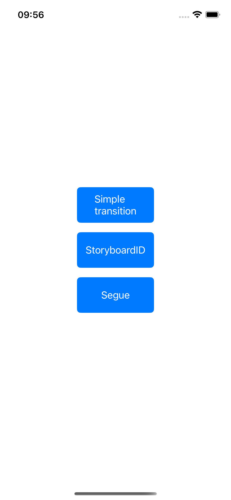
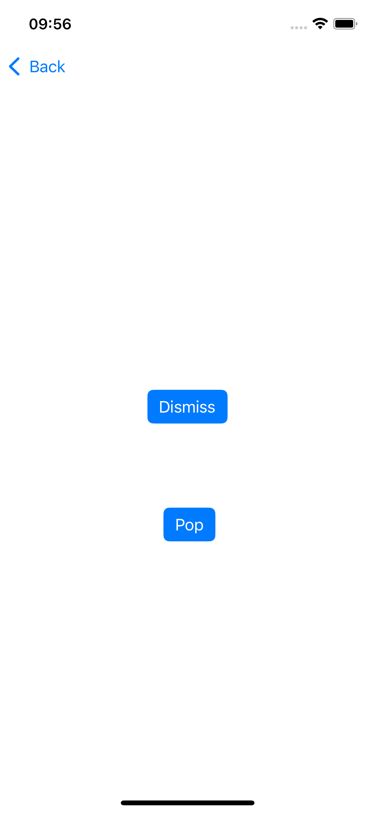
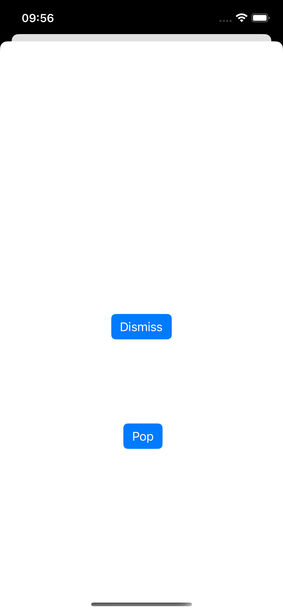

# NavigationApp

Приложение для навигации между экранами в iOS, написанное на Swift с использованием UIKit. Этот проект демонстрирует различные способы переходов между экранами, включая модальные переходы и использование навигационного стека.

Описание

Это приложение позволяет пользователю переходить между экранами с использованием следующих методов:
	•	Simple transition — переход с помощью модального представления и кнопок для возврата.
	•	StoryboardID — переход с использованием идентификатора в сториборде и отображение экрана модально.
	•	Segue — переход через сегвей, настроенный в сториборде.

Каждый переход имеет дополнительные кнопки для возврата:
	•	Dismiss — для закрытия экрана.
	•	Pop — для возврата на предыдущий экран в навигационном стеке (если переход был выполнен через навигацию).

Технологии

	•	Swift
	•	UIKit
	•	Xcode

Возможности

	•	Переходы между экранами с использованием модальных представлений и навигационного стека.
	•	Использование сторибордов для организации переходов.
	•	Два метода возврата: через Dismiss и Pop.
	•	Применение сегвеев для переходов между экранами.

Скриншоты

Установка

	1.	Склонируйте репозиторий:

git clone https://github.com/DanilaRuzh/NavigationApp.git

	2.	Откройте проект в Xcode
	3.	Запустите на симуляторе или устройстве

Контакты

Автор: DanilaRuzh
GitHub: https://github.com/DanilaRuzh
